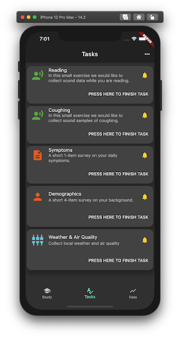
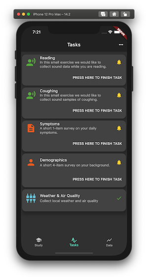
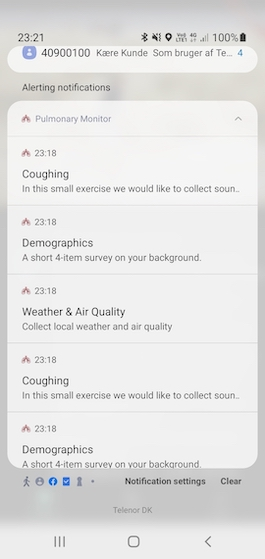

An [`AppTask`](https://pub.dev/documentation/carp_mobile_sensing/latest/domain/AppTask-class.html) is a user-facing task type in CAMS.

<CardGroup cols={2}>
  <Card title="Configure AppTasks" icon="sliders">
    Define app task metadata, measures, and triggers in your study protocol.
  </Card>
  <Card title="Run and Track Tasks" icon="play">
    Use `AppTaskController` and `UserTask` state/events to drive runtime behavior.
  </Card>
  <Card title="UI and Notifications" icon="bell">
    Render task cards in your app and notify users when tasks are available.
  </Card>
  <Card title="Extend the Model" icon="puzzle-piece">
    Add custom `UserTask` types and register a `UserTaskFactory`.
  </Card>
</CardGroup>

## End-to-end flow

<Steps>
  <Step title="Define an AppTask in protocol">
    Configure an `AppTask` with task metadata plus one or more background measures.
  </Step>
  <Step title="Trigger and enqueue a UserTask">
    When triggered, CAMS creates a `UserTask` and puts it on the task queue in the `AppTaskController`.
  </Step>
  <Step title="Render and execute in app UI">
    The app listens to the task queue and renders the task list and task for the user in the app, providing callback methods for starting, completing, or canceling tasks.
  </Step>
  <Step title="Handle completion and notifications">
    Task state transitions and local notifications are handled through the runtime APIs.
  </Step>
</Steps>

This page uses the [PulmonaryMonitor](https://github.com/cph-cachet/pulmonary_monitor_app) app as a running example.

<CardGroup cols={2}>
  <Card title="Task List">
    
  </Card>
  <Card title="Task Done">
    
  </Card>
</CardGroup>

## Configuring and using app tasks

App tasks are defined in the [`study_protocol_manager.dart`](https://github.com/cph-cachet/pulmonary_monitor_app/blob/master/lib/sensing/study_protocol_manager.dart) file.
For example, the sensing app task at the bottom of the list is created by this configuration:

````dart
var protocol = SmartphoneStudyProtocol(...);

...

// Define which devices are used for data collection.
Smartphone phone = Smartphone();
protocol.addPrimaryDevice(phone);

// Define the online weather service and add it as a 'device'
final weatherService = WeatherService(
  apiKey: '...',
);
protocol.addConnectedDevice(weatherService, phone);

// Define the online air quality service and add it as a 'device'
final airQualityService = AirQualityService(
  apiKey: '...',
);
protocol.addConnectedDevice(airQualityService, phone);

// Create an app task that collects air quality and weather data,
// and notify the user.
//
// Note that for this to work, the AirQualityService and WeatherService 
// need to be defined and added as connected devices to this phone.
var environmentTask = AppTask(
  type: AppTask.SENSING_TYPE,
  name: 'Environment Task',
  title: "Weather & Air Quality",
  description: "Collect local weather and air quality",
  notification: true,
  measures: [
    Measure(type: ContextSamplingPackage.WEATHER),
    Measure(type: ContextSamplingPackage.AIR_QUALITY),
  ],
);

// Make sure to always have an environment task on the task list by using
// a NoUserTaskTrigger.
protocol.addTaskControl(
  NoUserTaskTrigger(taskName: environmentTask.name),
  environmentTask,
  phone,
);
````

As shown above, an AppTask follows the [Trigger-Task-Measure domain model in CAMS](/carp-mobile-sensing/domain-model#defining-a-study-protocol); a trigger activates the task, and the task defines which measures to collect.
In comparison to an [`BackgroundTask`](https://pub.dev/documentation/carp_core/latest/carp_core_protocols/BackgroundTask-class.html), an [`AppTask`](https://pub.dev/documentation/carp_mobile_sensing/latest/domain/AppTask-class.html) can be configured with user-facing properties:

| Property | Purpose |
| --- | --- |
| `type` | Task type, for example sensing, survey, or audio. |
| `title` | Short title shown on the task card. |
| `description` | Short descriptive text shown on the task card. |
| `instructions` | More detailed guidance for the user. |
| `time to complete` | Estimated completion time for the task. |
| `notification` | Whether a notification is sent when a new task is available. |
| `expire` | When the task expires and is no longer available. |

The above code adds a [`NoUserTaskTrigger`](https://pub.dev/documentation/carp_mobile_sensing/latest/domain/NoUserTaskTrigger-class.html) with an [`AppTask`](https://pub.dev/documentation/carp_mobile_sensing/latest/domain/AppTask-class.html) of type `sensing` and measures `WEATHER` and `AIR_QUALITY`.
When triggered, the task is enqueued and can be shown in the app UI. When the user starts it (for example by pressing *PRESS HERE TO FINISH TASK*), a background task is started and collects the measures, and the app task is marked as done.

For more setup details, see the [PulmonaryMonitor](https://github.com/cph-cachet/pulmonary_monitor_app).

## App task execution

When an AppTask is triggered, it is executed by an [AppTaskExecutor](https://pub.dev/documentation/carp_mobile_sensing/latest/runtime/AppTaskExecutor-class.html):

1. Based on the AppTask configuration, a [`UserTask`](https://pub.dev/documentation/carp_mobile_sensing/latest/runtime/UserTask-class.html) is created. This user task embeds a [`BackgroundTaskExecutor`](https://pub.dev/documentation/carp_mobile_sensing/latest/runtime/BackgroundTaskExecutor-class.html) which, later (when the app task is started), is used to collect the measures.

2. This user task is enqueued in the [`AppTaskController`](https://pub.dev/documentation/carp_mobile_sensing/latest/runtime/AppTaskController-class.html). The AppTaskController is a singleton and is core to the handling of AppTasks, including creating notifications.

3. All triggered user tasks are available in the [`userTaskQueue`](https://pub.dev/documentation/carp_mobile_sensing/latest/runtime/AppTaskController/userTaskQueue.html) for custom rendering in the app.

4. The user task has set of [call-back methods](https://pub.dev/documentation/carp_mobile_sensing/latest/runtime/UserTask-class.html#instance-methods) for marking the task started, done, canceled, expired, all of which are called by the app.

5. When the user tak is started it uses a embedded `BackgroundTaskExecutor` to collect the measures. This background data collection is stopped when the task is marked as done or, if [one-time measures](http://localhost:3000/carp-mobile-sensing/measure-types#event-based-vs-one-time-measures), when then measures are collected.

## The `AppTaskController` and user task queue

In the PulmonaryMonitor, access to enqueued tasks is handled in [`sensing_bloc.dart`](https://github.com/cph-cachet/pulmonary_monitor_app/blob/master/lib/blocs/sensing_bloc.dart).
Use the [`userTaskQueue`](https://pub.dev/documentation/carp_mobile_sensing/latest/runtime/AppTaskController/userTaskQueue.html) property on `AppTaskController` to access the queue:

```dart
List<UserTask> get tasks => AppTaskController().userTaskQueue;
```

An app can also listen to events on the user task queue:

```dart
 AppTaskController().userTaskEvents.listen((event) {
   switch (event.state) {
     case UserTaskState.initialized:
       //
       break;
     case UserTaskState.enqueued:
       //
       break;
     case UserTaskState.dequeued:
       //
       break;
     case UserTaskState.started:
       //
       break;
     case UserTaskState.done:
       //
       break;
     case UserTaskState.canceled:
       // 
       break;
     case UserTaskState.expired:
       // 
       break;
     case UserTaskState.undefined:
       //
       break;
   }
 });
```

## Using user task(s) in the UI of the app

Enqueued user tasks can be rendered in any app-specific UI.
In the PulmonaryMonitor app, the task list shown above is implemented in [task_list_page.dart](https://github.com/cph-cachet/pulmonary_monitor_app/blob/master/lib/ui/task_list_page.dart).

For example, to build the scrollable list view of cards, the following `StreamBuilder` is used:

```dart
class TaskListPageState extends State<TaskListPage> {
  TaskListViewModel get model => widget.viewModel;

  @override
  Widget build(BuildContext context) => Scaffold(
    appBar: AppBar(title: const Text('Tasks')),
    body: ListenableBuilder(
      listenable: model,
      builder: (BuildContext context, Widget? child) => Scrollbar(
        child: ListView.builder(
          itemCount: model.tasks.length,
          padding: const EdgeInsets.symmetric(vertical: 8.0),
          itemBuilder: (context, index) =>
              getTaskCard(context, model.tasks[index]),
        ),
      ),
    ),
  );
  ...
}
```

To render the UI of each cards representing a user task, the following `StreamBuilder` is used:

```dart
Widget getTaskCard(BuildContext context, UserTask userTask) => Center(
  child: Card(
    elevation: 10,
    shape: RoundedRectangleBorder(borderRadius: BorderRadius.circular(15.0)),
    child: StreamBuilder<UserTaskState>(
      stream: userTask.stateEvents,
      initialData: UserTaskState.initialized,
      builder: (context, AsyncSnapshot<UserTaskState> snapshot) => Column(
        mainAxisSize: MainAxisSize.min,
        children: <Widget>[
          ListTile(
            leading: taskTypeIcon[userTask.type],
            title: Text(userTask.title),
            subtitle: Text(userTask.description),
            trailing: taskStateIcon[userTask.state],
          ),
          (userTask.availableForUser)
              ? OverflowBar(
                  children: <Widget>[
                    TextButton(
                      child: const Text('PRESS HERE TO FINISH TASK'),
                      onPressed: () {
                        userTask.onStart(); // Mark the task as started.

                        // Check if the task has a UI widget to be shown
                        if (userTask.hasWidget) {
                          // Push the task widget to the app.
                          // Note that the widget is responsible for calling the onDone method when the task is done.
                          Navigator.push(
                            context,
                            MaterialPageRoute<Widget>(
                              builder: (context) => userTask.widget!,
                            ),
                          );
                        } else {
                          // A non-UI sensing task that collects sensor data.
                          // Automatically stops after 10 seconds.
                          Timer(
                            const Duration(seconds: 10),
                            () => userTask.onDone(),
                          );
                        }
                      },
                    ),
                  ],
                )
              : const Text(""),
        ],
      ),
    ),
  ),
);
```

When the user taps `PRESS HERE TO FINISH TASK`, the user task is started using the `userTask.onStart()` method. If the task has a widget, that widget is pushed to the UI. For a non-UI sensing task, it starts and runs for 10 seconds.

A [UserTask](https://pub.dev/documentation/carp_mobile_sensing/latest/runtime/UserTask-class.html) has callback methods that can be called by the app:

| Callback | Purpose |
| --- | --- |
| [`onStart`](https://pub.dev/documentation/carp_mobile_sensing/latest/runtime/UserTask/onStart.html) | Starts the task and starts collecting defined measures. |
| [`onCancel`](https://pub.dev/documentation/carp_mobile_sensing/latest/runtime/UserTask/onCancel.html) | Cancels the task. |
| [`onDone`](https://pub.dev/documentation/carp_mobile_sensing/latest/runtime/UserTask/onDone.html) | Marks the task as done and typically stops measure collection. |
| [`onExpired`](https://pub.dev/documentation/carp_mobile_sensing/latest/runtime/UserTask/onExpired.html) | Handles expiration and removes the task from the queue. |
| [`onNotification`](https://pub.dev/documentation/carp_mobile_sensing/latest/runtime/UserTask/onNotification.html) | Called when the user taps the OS notification for this task. |

## Notifications

An app task can be configured with [`notification`](https://pub.dev/documentation/carp_mobile_sensing/latest/domain/AppTask/notification.html). If enabled, a local notification is sent with the task `title` and `description`.



This notification setup uses [`flutter_local_notifications`](https://pub.dev/packages/flutter_local_notifications) and requires app-level configuration. See [Install and Configure](/carp-mobile-sensing/install-and-configure).

## Types of app tasks

Currently, CAMS supports different types of AppTasks, all enumerated in the [`AppTask`](https://pub.dev/documentation/carp_mobile_sensing/latest/domain/AppTask-class.html) class:

| Type | Purpose |
| --- | --- |
| `SENSING_TYPE` | Collects sensing data in a background task. |
| `SURVEY_TYPE` | Starts a survey from the [carp_survey_package](https://pub.dev/packages/carp_survey_package). |
| `INFORMED_CONSENT_TYPE` | Show an informed consent flow to the user, typically using the [research_package](https://pub.dev/packages/research_package)  |
| `COGNITIVE_ASSESSMENT_TYPE` | Runs a cognitive assessment from the [carp_survey_package](https://pub.dev/packages/carp_survey_package). |
| `HEALTH_ASSESSMENT_TYPE` | Collects health data via the [carp_health_package](https://pub.dev/packages/carp_health_package). |
| `AUDIO_TYPE`, `VIDEO_TYPE`, `IMAGE_TYPE` | Collects media data via the [carp_audio_package](https://pub.dev/packages/carp_audio_package). |

## Extending the app task model

CAMS is extensible, so you can add custom app tasks by creating new `UserTask` types and registering them.
This is similar to extending measures and probes, as described in [Extending CAMS](/carp-mobile-sensing/extending-carp-mobile-sensing).

The `AudioUserTask` in the [Pulmonary Monitor](https://github.com/cph-cachet/pulmonary_monitor_app) is an example of a custom app task.
Its custom user task implementation is in [audio_user_task.dart](https://github.com/cph-cachet/pulmonary_monitor_app/blob/master/lib/sensing/audio_user_task.dart):

```dart
/// A user task handling audio recordings.
///
/// The [widget] returns an [AudioMeasurePage] that can be shown on the UI.
///
/// When the recording is started (calling the [onRecord] method),
/// the background task collecting sensor measures is started.
class AudioUserTask extends UserTask {
  static const String AUDIO_TYPE = 'audio';

  final StreamController<int> _countDownController =
      StreamController.broadcast();
  Stream<int> get countDownEvents => _countDownController.stream;
  Timer? _timer;

  /// Duration of audio recording in seconds.
  int recordingDuration = 10;

  AudioUserTask(super.executor, [this.recordingDuration = 10]);

  @override
  bool get hasWidget => true;

  @override
  Widget? get widget => AudioMeasurePage(audioUserTask: this);

  /// Callback when recording is to start.
  /// When recording is started, background sensing is also started.
  void onRecord() {
    backgroundTaskExecutor.start();

    // start the countdown, once tick pr. second.
    _timer = Timer.periodic(const Duration(seconds: 1), (_) {
      _countDownController.add(--recordingDuration);

      if (recordingDuration <= 0) {
        _timer?.cancel();
        _countDownController.close();

        // stop the background sensing and mark this task as done
        backgroundTaskExecutor.stop();
        super.onDone();
      }
    });
  }
}
```

To create and enqueue the right user-task type, CAMS uses a [UserTaskFactory](https://pub.dev/documentation/carp_mobile_sensing/latest/runtime/UserTaskFactory-class.html). Hence, you need to define such a user task factory for your custom types. For example, the factory for `AudioUserTask` looks like this:

```dart
/// A factory that can [create] a [UserTask] based on the type of app task.
/// In this case an [AudioUserTask].
class PulmonaryUserTaskFactory implements UserTaskFactory {
  @override
  List<String> types = [AppTask.AUDIO_TYPE];

  @override
  UserTask create(AppTaskExecutor executor) => switch (executor.task.type) {
    AppTask.AUDIO_TYPE => AudioUserTask(executor),
    _ => BackgroundSensingUserTask(executor),
  };
}
```

<Check>

Remember to register the custom factory in `AppTaskController`:

```dart
 AppTaskController().registerUserTaskFactory(PulmonaryUserTaskFactory());
```

This is typically done during the initialization of CAMS in the app. In PulmonaryMonitor, it happens when the `Sensing` class is created in [sensing.dart](https://github.com/cph-cachet/pulmonary_monitor_app/blob/master/lib/sensing/sensing.dart).

</Check>
