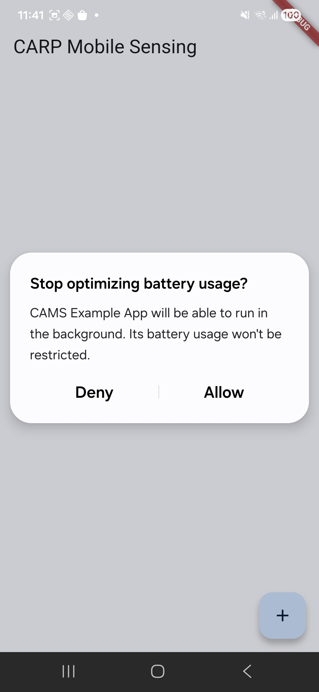
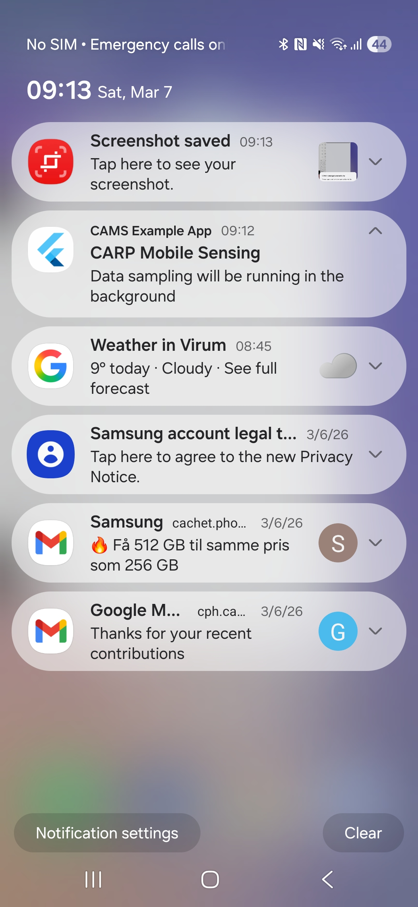
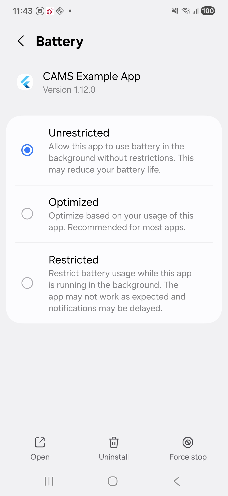
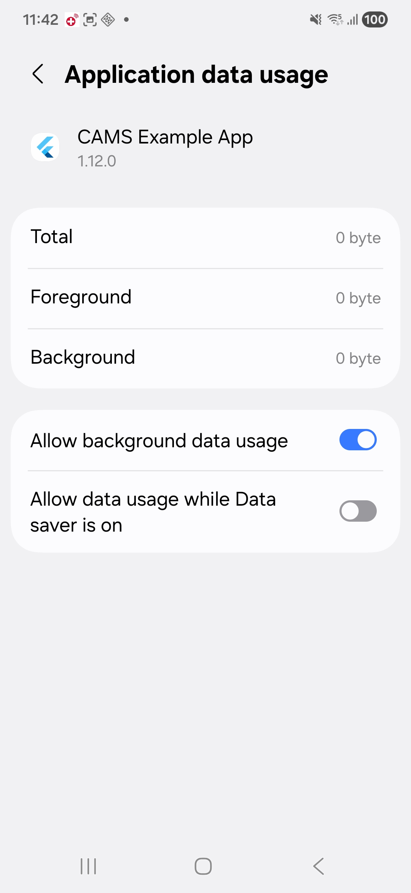
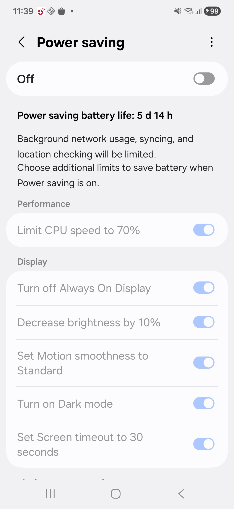
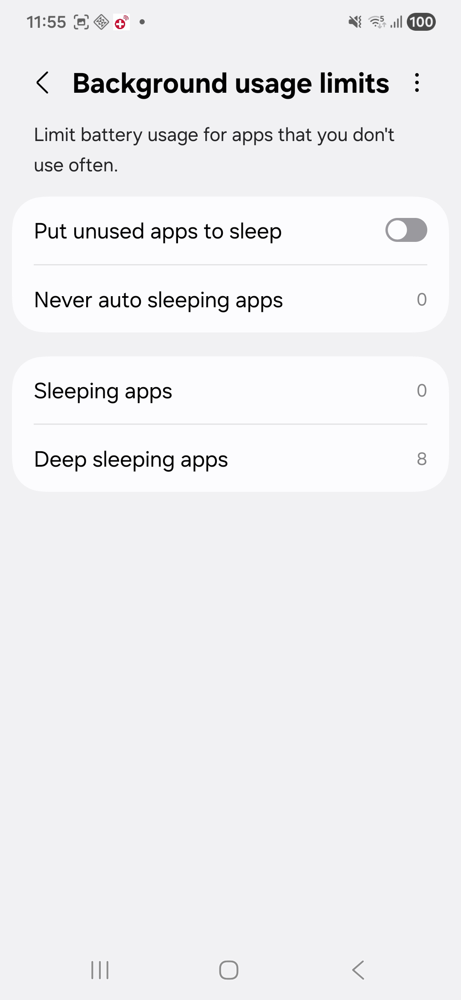

This page contain misc. platform-specific guidance and tips when running CAMS in production apps.

<CardGroup cols={2}>
  <Card title="Background sensing" icon="moon">
    Keep sampling stable on Android and iOS under power-management constraints.
  </Card>
  <Card title="iOS setup" icon="apple">
    Configure Podfile, file access, and platform-specific constraints.
  </Card>
  <Card title="Notifications" icon="bell">
    Set up local notification behavior required by app tasks and background flows.
  </Card>
  <Card title="Build and permissions" icon="screwdriver-wrench">
    Resolve common build issues and configure permissions correctly.
  </Card>
</CardGroup>

## Background sensing

Starting from version 2.0, CAMS supports background sensing natively on Android using the [flutter_background](https://pub.dev/packages/flutter_background) plugin.
iOS does not allow apps to run in the background as such, but there are a few things you can do to [optimize data sampling on iOS](/carp-mobile-sensing/best-practice#ios).

### Android

To keep the app running in the background, configure the `SmartPhoneClientManager` like this, specifying the title and text for the background notification:

```dart
SmartPhoneClientManager().configure(
  enableBackgroundMode: true,
  backgroundNotificationTitle: 'CARP Mobile Sensing',
  backgroundNotificationText:
      'Data sampling will be running in the background',
);
```

When background mode is enabled, the app will show this battery optimization permission popup and the notification.

<CardGroup>
<Card title="Battery Optimization Permission">
    
</Card>
<Card title="Background Notification">
    
</Card>
</CardGroup>

On Android version >= 9, battery management has been significantly improved. There are repeatedly reported issues with some Android devices not working in the background. Check if your device model is on [dontkillmyapp](https://dontkillmyapp.com) list before you report new issue. This means that an app will be put to sleep when in the background. This is less useful, if the app is using CAMS for passive data collection.

The [dontkillmyapp](https://dontkillmyapp.com) site provides suggestions for different phone vendors and OS versions. A general approach is configure settings for the battery and for the app itself.

<AccordionGroup>
  <Accordion title="App-specific Options">
  In the Android Settings, you can optimize background mode for the app by allowing urestricted battery and background data usage.
  <CardGroup>
    <Card title="Unrestricted Battery Usage">
      
    </Card>
    <Card title="Background Data Usage">
      
    </Card>
  </CardGroup>
  </Accordion>

  <Accordion title="Battery Settings Options">
  In the Android Settings, you can optimize the battery setting for background mode

  <CardGroup>
    <Card title="Power Savings Off">
      
    </Card>
    <Card title="Background Usage Limits Off">
      
    </Card>
  </CardGroup>
  </Accordion>

</AccordionGroup>

#### Resources

* See [Issue #97](https://github.com/cph-cachet/carp.sensing-flutter/issues/97) for a discussion on background sensing.
* See [this thread on Reddit](https://www.reddit.com/r/samsung/comments/1b0j8jg/s24_ultra_stop_closing_my_apps/) on how to keep an app running in the background on Samsung phones.
* See the [Don't Kill My App](https://dontkillmyapp.com/) site and suggestions, e.g. for [Samsung](https://dontkillmyapp.com/samsung) phones.
* This [setup page for the Cardata app](https://help.cardata.co/article/175-how-to-turn-off-your-androids-battery-optimizer) also have some simple guidelines for different phones.

### iOS

On iOS, the best way to keep the app running somewhat in the background is to have the app fetch location in the background or keep a BLE connection to an external device.

The [`carp_context_package`](https://pub.dev/packages/carp_context_package) makes use of the [`location`](https://pub.dev/packages/location) plugin, which supports the collection of location "in the background". It is important to follow the instruction of the package, including modifying the `info.plist` and `AppDelegate.swift` files. Also make sure that "Allow location tracking always" is enabled for the app on the phone.

iOS tends to [aggressively kill apps](https://developer.apple.com/forums/thread/696275) (especially after iOS v. 15). There are a few things to do about this:

<AccordionGroup>
  <Accordion title="Disable Low Power Mode">
    In **Settings → Battery**, ensure **Low Power Mode** is **OFF**.
  </Accordion>

  <Accordion title="Enable Background App Refresh">
    In **Settings → [Your app] → Background App Refresh**, ensure it is **ON**.

    If this option is greyed out, first enable it globally in **Settings → General → Background App Refresh**, then enable it per app.
  </Accordion>
</AccordionGroup>

#### Guided Access

You can also force the app to always be in the foreground by using the [Guided Access](https://support.apple.com/en-us/HT202612) feature in iOS. This feature forces the app to be the *only* app running in the foreground always and is hence not useful for background sensing. But it may be useful if the phone is dedicated to running an app for a specific study. For example, if a dedicated study phone is handed to a user to be used only for a specific study.

#### Audio Playing Hack

Another "hack" to keep the app running in the background is to configure it as an audio player app. Audio playing apps are kept running in the background on iOS. See the [sensors](https://github.com/olafuroskar/Bridging-Labs/tree/main/apps/sensors) app for inspiration.

#### Keeping a BLE connection open

As presented in [this coverage study](https://carp.dk/coverage-analysis-on-android-14-and-ios-18/), iOS keeps the app running in the background if it samples data from a BLE device. Note, however, that this really drains the battery.

## iOS setup

### Manually edit `Podfile`

In a new Flutter project, the iOS `Podfile` is auto-generated in the `ios` folder. To make things work, there are a few edits to this file that need to be done:

* Specify the platform version, like adding `platform :ios, '12.0'` (should be later than 9.3).
  * Note that you might need to do this also manually in XCode also - see [this issue](https://github.com/tanersener/flutter-ffmpeg/issues/43).
* In the `post_install` part, you should make sure that the `config.build_settings` is also set to the same platform version (see [here](https://stackoverflow.com/questions/63948739/flutter-could-not-build-the-precompiled-application-for-the-device-error-laun) and [here](https://stackoverflow.com/questions/61956166/flutter-module-not-found-in-xcode)).
* Specify the Swift version by adding `ENV['SWIFT_VERSION'] = '5'`
* In the `target 'RUNNER'` part, add the following lines `use_frameworks!` and `use_modular_headers!` (if not already added by Flutter)
* In the `target 'RUNNER'` part, also **remove** the `target 'RunnerTests'` part (this may cause build issues).

An example of the edited `Podfile` would look like:

```ruby
# Uncomment this line to define a global platform for your project
platform :ios, '12.0'

# CocoaPods analytics sends network stats synchronously affecting flutter build latency
ENV['COCOAPODS_DISABLE_STATS'] = 'true'
ENV['SWIFT_VERSION'] = '5'

...

target 'Runner' do
  use_frameworks!
  use_modular_headers!

  flutter_install_all_ios_pods File.dirname(File.realpath(__FILE__))

  # target 'RunnerTests' do
  # inherit! :search_paths
  # end
end

post_install do |installer|
  installer.pods_project.targets.each do |target|
    flutter_additional_ios_build_settings(target)
    target.build_configurations.each do |config|
      config.build_settings['IPHONEOS_DEPLOYMENT_TARGET'] = '12.0'
    end
  end
end

```

### File management

If you want to store data locally on the phone (using the `SQLiteDataManager` or `FileDataManager`), and want to grant the user of your app  (e.g. yourself during development and debugging) access to it on the phone or in a Mac Finder, add the following keys to `Info.plist`.

```xml
<key>UIFileSharingEnabled</key>
<true/>
<key>LSSupportsOpeningDocumentsInPlace</key>
<true/>
```

### Wi-Fi

Note that on iOS>=12, collection of WiFi info has been restricted – please see

* [connectivity](https://pub.dev/packages/connectivity)
* [CNCopyCurrentNetworkInfo](https://developer.apple.com/documentation/systemconfiguration/1614126-cncopycurrentnetworkinfo)
* [Access WiFi Information Entitlement](https://developer.apple.com/documentation/bundleresources/entitlements/com_apple_developer_networking_wifi-info?language=objc)
* [How To Enable the WiFi Information Entitlement in iOS 13](https://medium.com/better-programming/wifi-permission-changes-for-ios-12-1-iphone-x-and-other-devices-c313e24f90ae)

### `App.framework` compatibility

You may get this error:

```

Building for iOS, but the linked and embedded framework 'App.framework' was built for iOS Simulator.

```

or vice-versa. This is a well-known issue on iOS / XCode 11.4 for Flutter version less than v1.15.3.
See the Flutter [Xcode 11.4 Support](https://flutter.dev/docs/development/ios-project-migration) page.

## Notifications

The default notification controller used in CAMS is [FlutterLocalNotificationManager](https://pub.dev/documentation/carp_mobile_sensing/latest/infrastructure/FlutterLocalNotificationManager-class.html), which uses the [flutter_local_notifications](https://pub.dev/packages/flutter_local_notifications) plugin. It supports scheduling and receiving notifications while the app is in foreground, background, or terminated, but requires platform-specific setup.

<Info>
Follow the [flutter_local_notifications README](https://pub.dev/packages/flutter_local_notifications) and platform setup guides for [Android](https://pub.dev/packages/flutter_local_notifications#-android-setup) and [iOS](https://pub.dev/packages/flutter_local_notifications#-ios-setup).
</Info>

## Initializing `WidgetsFlutterBinding`

To initialize the Flutter platform channels, you need to call `WidgetsFlutterBinding.ensureInitialized()` in your `main()` method, before creating the app. For example - this is the main method of the CAMS demo app:

```dart
void main() async {
  // makes sure to have an instance of the WidgetsBinding, which is required
  // to use platform channels to call the native code.
  WidgetsFlutterBinding.ensureInitialized();

  await bloc.initialize();
  runApp(App());
}
```

Here is a description of [What Does `WidgetsFlutterBinding.ensureInitialized()` do?](https://stackoverflow.com/questions/63873338/what-does-widgetsflutterbinding-ensureinitialized-do/63873689).

## Android manifest merge

When building your app, the `AndroidManifest.xml` files from all packages and their underlying plugins are [merged](https://developer.android.com/studio/build/manage-manifests#merge-manifests).

When you want to publish your app, which uses various CARP packages and plugins, to the Google Play Store, it can be rejected because it e.g.., tries to collect SMS texts and call logs, which Google considers to be a [restricted group of permissions](https://support.google.com/googleplay/android-developer/answer/10208820?visit_id=637547856829628711-3104765488&rd=1&hl=en) for which you need a valid reason to access those. Unfortunately, research is not in the list of exceptions. Hence, we would like to remove collection of SMS texts and call logs while still keeping collection of calendar information (all in the `carp_communication_package`).

Illegal permissions can be omitted by specifying that they should not be merged from a lower level manifest. This is done by adding the following lines to the `AndroidManifest.xml` file of your app, which prevents the restricted permissions from being added:

```xml
<uses-permission android:name="android.permission.READ_CALL_LOG" tools:node="remove"/>
<uses-permission android:name="android.permission.READ_SMS" tools:node="remove"/>
<uses-permission android:name="android.permission.SEND_SMS" tools:node="remove"/>
<uses-permission android:name="android.permission.RECEIVE_SMS" tools:node="remove"/>
```

See also [issue #183](https://github.com/cph-cachet/carp.sensing-flutter/issues/183). Thanks to [koenniem](https://github.com/koenniem) for this update.

## Permissions

CAMS uses the [`permission_handler`](https://pub.dev/packages/permission_handler) plugin for handling permissions. Please see their documentation on how to configure permissions on both iOS and Android. In particular, update both `Info.plist` and `Podfile` on iOS; otherwise you may have [app review issues with Apple](https://github.com/Baseflow/flutter-permission-handler/issues/26).

## Build issues

If you're experiencing any build issue, try these steps:

1. Run this in your project and try again:

```bash
flutter clean
rm -rf build
rm -rf ~/.pub-cache

flutter pub get
```

On Android, you might also want to run `./gradlew clean`. On iOS, you might want to remove the `.symlink` folder.

1. Update Xcode, Android Studio, VS Code, and Android SDKs to the latest versions.
2. If the issue persists, clone `carp_mobile_sensing` and run the `example` app on the same platform. If that works, compare your project with the example setup.
3. If the issue still persists and there is no existing GitHub issue, open a new issue. Use the issue template and provide a reproducible case based on the `example` app.
4. Only open an issue after step 3. Build issues without reproducible example details may be closed.

## MissingPluginException or PlatformException

You may get `MissingPluginException` or `PlatformException` on plugins which are used by CAMS (like flutter_background). Even though the "pub get" and "pub upgrade" commands do get and update these transitive plugins, and the app compiles, you may still need to explicitly depend on them in you app's `pubspec.yaml` file. See issue [#530](https://github.com/carp-dk/carp.sensing-flutter/issues/530).
